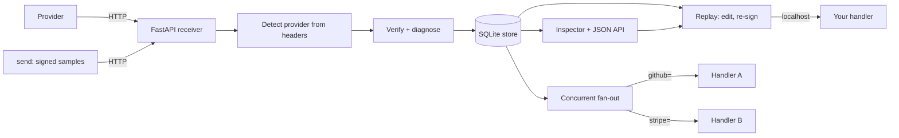
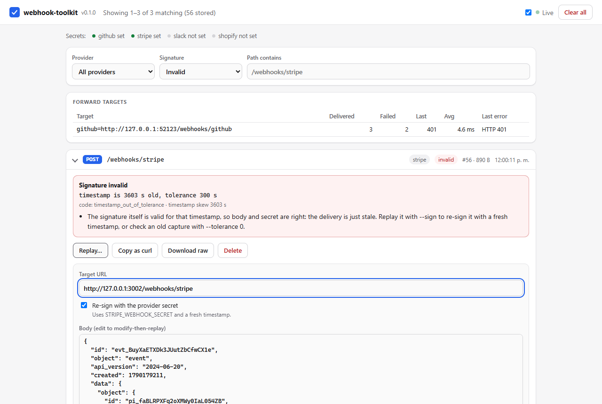

# webhook-toolkit

**Receive, verify, inspect and replay webhooks locally — no tunnel required.**


A local webhook development bench. Point a provider — or the built-in **event
simulator** — at a FastAPI receiver that stores every request byte-for-byte,
verifies the provider signature and, when it fails, **explains why** (trailing
newline, re-serialized JSON, stale timestamp, wrong or swapped secret...). Then
**replay** any stored event to the handler you are building — edited if you
like, re-signed with a fresh timestamp so it passes verification — from the CLI
or the browser inspector, or **fan-out** live deliveries to several local
services at once.

## Why

Webhooks are miserable to develop against. The provider lives on the public
internet; your handler lives on `localhost`. The usual answers are all annoying:

- **Tunnels** (ngrok, smee) expose your laptop, add latency, and the URL changes.
- **Real events** are slow to trigger and impossible to reproduce on demand.
- **Signature verification** is the one part you must not skip — and the one part
  that silently breaks the moment you re-serialize the body or replay a stale
  payload past its timestamp tolerance.

This toolkit removes the tunnel from the inner loop. Generate realistic signed
events offline (or capture a real delivery once), then iterate on your handler
by replaying them locally as many times as you like, with correct signatures,
in milliseconds — and when a signature does not verify, get the reason instead
of a bare "invalid".

## How it works



The receiver is a catch-all: `GET`, `POST`, `PUT`, `PATCH`, `DELETE`, `HEAD` and
`OPTIONS` on any path are captured, so you never have to configure routes to
start seeing traffic. The only routes it keeps for itself are the inspector's
(`GET /`, `GET /favicon.ico` and the [JSON API](#http-api) under `/api/`, each
only for its own method); FastAPI's `/docs`, `/redoc` and `/openapi.json` are
switched off so they are captured too. Bodies are stored as raw
bytes because signatures are computed over the exact byte stream — re-encoding
through a string would break verification on replay.

## Provider signatures

Each provider signs differently. The toolkit knows the exact header and scheme
for the common ones, plus a generic HMAC helper for everything else.

| Provider | Header | Scheme |
|----------|--------|--------|
| **GitHub** | `X-Hub-Signature-256` | `sha256=` + hex HMAC-SHA256 of the raw body |
| **Stripe** | `Stripe-Signature` | `t=<ts>,v1=<hex>` HMAC-SHA256 over `<ts>.<body>`, timestamp tolerance |
| **Slack** | `X-Slack-Signature` | `v0=` + hex HMAC-SHA256 over `v0:<ts>:<body>`, timestamp in `X-Slack-Request-Timestamp` |
| **Shopify** | `X-Shopify-Hmac-Sha256` | base64 HMAC-SHA256 of the raw body |
| **Generic** | *(you choose)* | HMAC of the raw body with configurable header, digest, hex or base64 encoding and prefix |

The generic provider is configured with `GENERIC_WEBHOOK_HEADER`,
`GENERIC_WEBHOOK_ALGORITHM` (`sha256` default, also `sha1`, `sha512`, ...),
`GENERIC_WEBHOOK_ENCODING` (`hex`/`base64`), `GENERIC_WEBHOOK_PREFIX` and
`GENERIC_WEBHOOK_SECRET`. Once the header is set, the receiver detects and
verifies it like the built-in providers, `replay --sign` re-signs it, and
`verify --provider generic` accepts the same settings as options.

> ### Always verify signatures
> An unverified webhook endpoint is an **unauthenticated POST from the internet**.
> Anyone who learns the URL can forge events. Verify the signature over the raw
> body **before** you parse or act on the payload, and reject on mismatch. Every
> example handler in this repo does exactly that (`verify_github` / `verify_stripe`
> return `401` / `400` on failure). Stripe and Slack additionally bind a timestamp
> into the signature to blunt replay attacks — which is why replaying an old
> capture requires re-signing with a fresh one.

## Quickstart

Install the `webhook-toolkit` command (Python 3.10+):

```bash
pip install "git+https://github.com/AleBrito124356/webhook-toolkit"
webhook-toolkit --version
webhook-toolkit samples
```

or work from a checkout (needed for the example handlers and the demo):

```bash
git clone https://github.com/AleBrito124356/webhook-toolkit.git
cd webhook-toolkit
python -m venv .venv && source .venv/bin/activate   # Windows: .venv\Scripts\activate
pip install -e ".[dev]"      # or: pip install -r requirements-dev.txt

cp .env.example .env        # then fill in the signing secrets you have
```

Every `python cli.py <command>` below is the same as `webhook-toolkit <command>`
once the package is installed.

Every command reads `./.env` on startup (or the file given with
`--env-file FILE`); variables already exported in your shell win over the file.
The example handlers read the same `.env`, so both sides share one secret.

Every secret in `.env.example` is an obvious placeholder — a literal `X` run or
a plainly-fake string — that no provider will accept. The toolkit treats them
explicitly:

- the **receiver** never labels a capture `invalid` because of a placeholder (a
  real provider cannot sign with one); it shows `not checked` instead, and only
  shows `verified` when the capture really was signed with that placeholder;
- **explicit commands** (`verify`, `replay --sign`, `send --sign`) still use a placeholder, with
  a visible warning, so the local walkthrough against the bundled example
  handlers (which fall back to the same placeholders) works before you have
  real secrets.

## The no-tunnel workflow

### See the whole loop in one command

```bash
python examples/offline_demo.py
```

The demo starts the receiver and both example handlers on ephemeral loopback
ports, generates fresh random secrets, and then checks every feature for real:
all 14 bundled samples are signed, delivered and verified; a tampered, a
wrongly-signed and an hour-old delivery are each diagnosed; stored events are
replayed to the handlers with and without re-signing and with an edited body;
samples are sent straight to the handlers; the inspector's JSON API is driven
the way the browser does; and a second receiver fans captures out to both
handlers plus a failing one. It ends with:

```
PASS a cross-site page cannot clear the captures - status 403
PASS github= target got only the GitHub event - delivered 1, last status 200
PASS stripe= target got only the Stripe event - delivered 1, last status 200
PASS a 503 target is retried, counted as failed, and does not block the others - failed 2, last error HTTP 503
─────────────────────────────────── Summary ───────────────────────────────────
36/36 checks passed in 3.4 s, loopback only, no tunnel and no provider account.
```

### Do it yourself

**1. Start the receiver + inspector.**

```bash
python cli.py serve --port 8000
```

```
──────────────────────── webhook-toolkit ────────────────────────
Inspector : http://127.0.0.1:8000/
Receiver  : any method on http://127.0.0.1:8000/<any-path>
API       : http://127.0.0.1:8000/api/events
Database  : webhooks.db
──────────────────────────────────────────────────────────────────
```

Open `http://127.0.0.1:8000/` for the live inspector.

**2. Generate realistic, signed events — no provider needed.** `samples` lists
the bundled events; `send` renders one with fresh ids and timestamps, adds the
provider's real companion headers (`X-GitHub-Event`, `X-GitHub-Delivery`,
`X-Shopify-Topic`, `X-Slack-Request-Timestamp`, ...), signs it and delivers it.
A URL without a path uses the sample's own path.

```bash
python cli.py samples                     # 14 events: GitHub, Stripe, Slack, Shopify
python cli.py send github push --to http://127.0.0.1:8000 --sign
python cli.py send stripe payment_intent.succeeded --to http://127.0.0.1:8000 --secret whsec_wrong
```

```
OK sent github/push -> http://127.0.0.1:8000/webhooks/github | status 200 | 10 ms | signed (GITHUB_WEBHOOK_SECRET)
OK sent stripe/payment_intent.succeeded -> http://127.0.0.1:8000/webhooks/stripe | status 200 | 11 ms | signed (--secret)
```

and the receiver's console explains the second one:

```
#1 POST /webhooks/github | github | verified | 2057 B | 2026-09-23T16:42:14.979419Z
#2 POST /webhooks/stripe | stripe | invalid | 890 B | 2026-09-23T16:42:15.798059Z
   signature does not match this body and secret
```

| Provider | Sample events |
|---|---|
| GitHub | `ping`, `push`, `pull_request.opened`, `issues.opened` |
| Stripe | `payment_intent.succeeded`, `payment_intent.payment_failed`, `checkout.session.completed`, `invoice.paid` |
| Slack | `url_verification`, `app_mention` (Events API, JSON), `slash_command` (form-encoded) |
| Shopify | `orders/create`, `products/update`, `app/uninstalled` |

Useful `send` options: `--set data.object.amount=5000` edits a body field
before signing (dotted path, list indices allowed, value parsed as JSON when
possible), `--count N` sends N fresh copies, `--store` saves the event straight
into the database instead of (or as well as) sending it, `--dry-run` prints the
exact request, and `--now <epoch>` signs with an old timestamp to reproduce a
stale delivery.

**3. Replay any capture at your handler as many times as you want**,
re-signing so it verifies against your handler's secret:

```bash
python cli.py replay 1 --to http://127.0.0.1:3001/webhooks/github --sign
```

```
OK replay #1 -> http://127.0.0.1:3001/webhooks/github (re-signed) | status 200 | 7 ms
```

A real provider delivery works the same way: capture it once (dashboard
"resend", or one tunnelled delivery) and replay it forever. No provider
round-trip, no tunnel, fully reproducible.

## Usage

### The inspector: a replay workbench in the browser

`serve` (and `forward`) host the inspector at `http://127.0.0.1:8000/`. It is a
single self-contained page (no CDN, no build step) that:

- lists captures newest first with the **true total**, pages through all of
  them, and filters by provider (including `unsigned`), signature result
  (verified / invalid / not checked) and path;
- expands a capture into its **signature diagnosis** (reason, code, timestamp
  skew and the hints from the diagnosis engine), pretty-printed body and headers;
- **replays** it to any URL, re-signed with the provider secret and a fresh
  timestamp, optionally with an **edited body** and extra headers, and shows
  the handler's answer — the edit survives the live refresh while you type;
- **copies the replay as a `curl` command** (signed, byte-exact body),
  **downloads the raw bytes**, **deletes** a capture or **clears** them all;
- shows the **forward-target counters** when `forward` is running.



Captured bodies are untrusted input, so the page never renders them as HTML,
raw downloads are served as `application/octet-stream` with `nosniff`, and the
mutating API routes refuse cross-site browser requests (`Origin` /
`Sec-Fetch-Site` checks; replay only accepts `application/json`, which a
cross-site form cannot send without a CORS preflight).

### Serve and forward

```bash
# Receive only
python cli.py serve --port 8000

# Receive AND fan-out every capture to local handlers (a mini smee).
# PROVIDER=URL only forwards that provider's events, so each handler gets
# only what it can verify; a bare URL gets everything.
python cli.py forward --port 8000 \
    --to github=http://127.0.0.1:3001/webhooks/github \
    --to stripe=http://127.0.0.1:3002/webhooks/stripe \
    --to http://127.0.0.1:3003/everything
```

Targets are delivered **concurrently**, so a dead or slow handler never delays
the others. Connection errors and 5xx responses are retried (2 retries, linear
backoff); a 4xx is a definitive answer and is not retried. Each result is
printed as soon as that target finishes, with running totals, and the same
counters are served at `GET /api/forward` and shown in the inspector:

```
#1 POST /webhooks/github | github | verified | 2057 B | 2026-09-23T17:12:23.870210Z
   forward #1 -> github=http://127.0.0.1:3001/webhooks/github 200 ok (1 attempt, 5 ms) | totals: 1 delivered, 0 failed
   forward #1 -> http://127.0.0.1:3003/everything HTTP 503 (3 attempts, 1510 ms) | totals: 0 delivered, 1 failed
```

### HTTP API

Everything the inspector does is plain JSON over HTTP, so it can be scripted:

| Route | What it does |
|---|---|
| `GET /api/events?limit=&offset=&provider=&verified=&q=&summary=` | captures, newest first; `count` (matching) and `total` (stored); `verified` is `1`, `0` or `none`; `provider=unsigned` for requests without a known signature |
| `GET /api/events/{id}` | one capture with a live `assessment` (verified, reason and full diagnosis with hints) |
| `GET /api/events/{id}/raw` | the exact body bytes as a download |
| `POST /api/events/{id}/replay` | JSON `{"to", "sign", "secret", "provider", "body" or "body_base64", "headers", "timeout"}`; returns status, timing, response snippet, the headers sent and warnings |
| `POST /api/events/{id}/curl` | the same replay rendered as a `curl` command |
| `DELETE /api/events/{id}`, `DELETE /api/events` | delete one capture / all of them |
| `GET /api/forward` | per-target counters: delivered, failed, last status/error/event, average time |
| `GET /api/status` | version, database, tolerance, each provider's secret *state* (never the value), forward targets |

These routes (plus `GET /` and `GET /favicon.ico`) are the only ones the
receiver keeps for itself, and only for those exact methods: `POST /api/events`
or `GET /api/events/abc` are captured like any other request.

### Replay and modify-then-replay

```bash
# Replay stored event 2 to a Stripe handler, re-signing with the env secret
python cli.py replay 2 --to http://127.0.0.1:3002/webhooks/stripe --sign

# Debug a handler with an edited payload — re-signing keeps the signature valid
python cli.py replay 2 --to http://127.0.0.1:3002/webhooks/stripe \
    --sign --body edited_payload.json --header "X-Debug: 1"
```

### Verify a payload + signature pair — and find out *why* it fails

```bash
python cli.py verify --provider github \
    --payload payload.json \
    --signature "sha256=3e5403108ea4212413f575f986530161303770c55684656aeb4c4f1a8cef8a9c" \
    --secret my-dev-secret
```

```
INVALID GitHub signature (signature matches the payload with the trailing newline removed)
  code: mismatch
  hint: Something changed the bytes after they were signed (an editor saving the file, `echo`, a shell heredoc). Verify the exact bytes that were received.
```

A failure is never just "invalid". The diagnosis engine (`verify.diagnose`)
classifies it as `missing_signature_header`, `malformed_header`,
`missing_timestamp`, `timestamp_out_of_tolerance` (with the skew in seconds and
its direction) or `mismatch`, and for mismatches it re-computes the HMAC under
the mistakes people actually make until one explains the failure:

| Mistake it recognises | Example explanation |
|---|---|
| Trailing newline / CRLF added or removed, LF↔CRLF conversion (git `autocrlf`) | `signature matches the payload with CRLF line endings converted to LF` |
| JSON parsed and re-serialized (compact, `json.dumps` defaults, pretty, sorted keys, escaped non-ASCII) | `signature matches the payload re-serialized as compact JSON (no spaces)` |
| Whitespace or a newline around the secret | `signature matches the secret with surrounding whitespace removed` |
| Stripe `whsec_` prefix missing, dropped by the sender, or duplicated | `signature matches the secret with a 'whsec_' prefix added` |
| Svix / Standard Webhooks secrets (base64 after `whsec_`), hex-decoded secrets | `signature matches the base64-decoded secret (Svix / Standard Webhooks scheme)` |
| Secrets swapped between configured providers | `signature matches the secret configured for Shopify (SHOPIFY_WEBHOOK_SECRET)` |
| Hex vs base64, missing `sha256=` / `v0=` prefix, SHA-1 instead of SHA-256, uppercase hex | `the digest is hex-encoded but Shopify sends base64` + "the digest itself is correct" |
| Only GitHub's legacy `X-Hub-Signature` (SHA-1) present | "it matches your secret … whatever delivered this dropped X-Hub-Signature-256" |
| Stripe/Slack signature computed without the timestamp | `signature is an HMAC of the body alone, without the timestamp` |
| Stale or future timestamps, millisecond timestamps | `timestamp is 3601 s old, tolerance 300 s` + "the signature itself is valid … replay it with --sign" |

Exit codes: `0` valid, `1` invalid, `2` usage error (missing secret, bad
options). `--json` prints the diagnosis as JSON, `--header 'Name: value'` adds
extra request headers (e.g. the legacy `X-Hub-Signature`), `--tolerance 0`
disables the Stripe/Slack timestamp check and `--now <epoch>` pins the clock.
`python cli.py show <id>` prints a stored capture with the same diagnosis; the
receiver stores the one-line reason with every capture and `list` shows it.

### Inspect, export, import

```bash
python cli.py list --limit 20                       # recent captures as a table
python cli.py import examples/fixtures/github_push.json
python cli.py export my_fixtures.json               # share a reproduction
```

Fixtures are plain JSON with base64-encoded bodies, so binary payloads round-trip
exactly and you can commit them as deterministic test inputs.

### Use the verifiers in your own handler

```python
from fastapi import FastAPI, Header, HTTPException, Request
from webhooks.verify import diagnose, verify_github

app = FastAPI()

@app.post("/webhooks/github")
async def github(request: Request, x_hub_signature_256: str | None = Header(None)):
    raw = await request.body()                     # raw bytes, never a parsed model
    if not verify_github(SECRET, raw, x_hub_signature_256):
        # Optional: log *why* (never return this detail to the caller).
        print(diagnose("github", SECRET, raw, dict(request.headers)).reason)
        raise HTTPException(401, "invalid signature")
    ...  # safe to parse and act now
```

`verify_stripe`, `verify_slack`, `verify_shopify` and `verify_generic` work the
same way, and every `sign_*` twin produces the exact header a provider sends —
handy for your own tests. `webhooks.testing.BackgroundServer` runs any ASGI app
on a free loopback port for integration tests. Full runnable handlers live in
`examples/handlers/` (from a checkout, `import src.webhooks...` keeps working
too).

## Project structure

```
webhook-toolkit/
├── cli.py                       # `python cli.py ...` shim for a source checkout
├── pyproject.toml               # package + `webhook-toolkit` console script
├── src/webhooks/
│   ├── cli.py                   # serve, forward, send, samples, replay, verify, show, list, export, import
│   ├── server.py                # catch-all receiver, JSON API, live console
│   ├── inspector.py             # self-contained inspector page (no CDN)
│   ├── verify.py                # sign_/verify_ pairs, generic HMAC, diagnose()
│   ├── inbound.py               # verified / invalid / not checked + reason for a capture
│   ├── samples.py               # offline event simulator (render, override, sign)
│   ├── templates/<provider>/    # 14 sample events with realistic headers
│   ├── replay.py                # build/send replays, re-signing, curl rendering
│   ├── forward.py               # concurrent fan-out, provider routing, stats
│   ├── storage.py               # SQLite store, raw-byte bodies, filters, migrations
│   ├── fixtures.py              # JSON export / import
│   ├── config.py                # .env loader, secret states, generic scheme
│   └── testing.py               # BackgroundServer for loopback integration tests
├── examples/
│   ├── offline_demo.py          # the whole loop in one command (36 checks)
│   ├── handlers/                # verified GitHub push + Stripe payment handlers
│   └── fixtures/github_push.json
├── docs/inspector.png
├── tests/                       # 267 tests, see below
├── CHANGELOG.md
├── .env.example
└── requirements*.txt
```

## Design notes

- **Symmetric sign/verify.** Every provider has a `sign_*` that produces exactly
  the header a provider would send and a `verify_*` that checks one in constant
  time (`hmac.compare_digest`). Re-signing on replay and computing test vectors
  both fall out of the signing half — so no real-looking token is ever hardcoded.
- **Pure builders, isolated I/O.** `build_replay_request` is a pure function that
  turns a stored event into the outgoing request; the network call is one thin
  wrapper around it. That is why re-signing is unit-tested without a socket.
- **Raw bytes end to end.** Bodies are `BLOB`s and never decoded before hashing,
  so a replayed payload is byte-identical to the original. Hop-by-hop headers
  (`Transfer-Encoding`, `Connection` and friends) are dropped on replay and
  forward, so a chunked capture is re-sent as valid HTTP.
- **Diagnosis never changes the verdict.** `diagnose()` reports `valid` exactly
  when the strict `verify_*` function does; the variant search only runs to
  explain a failure.

## Testing

```bash
pip install -e ".[dev]"
pytest                       # 267 tests, ~20 s, offline, loopback only
coverage run -m pytest && coverage report   # 97% (statements + branches)
```

The suite computes every expected signature **inside the test** from a fake,
runtime-assembled secret, then checks that tampering the body, the secret, or the
timestamp is rejected — no credential-shaped strings live on disk. It covers one
test per diagnosis code and per recognised mistake, every sample through the
receiver (right and wrong secret), the JSON API (filters, paging, replay,
curl, the cross-site guard), forwarding with `httpx.MockTransport` (retries,
the 4xx rule, concurrency, routing), `.env` handling, a raw-socket check of the
replayed bytes, the generated `curl` command executed with bash + curl, and
real processes: `serve` + `send` as separate processes and the offline demo.
A leaked SQLite connection or socket fails the run (`ResourceWarning` is an
error in `pytest.ini`).

See [CHANGELOG.md](CHANGELOG.md) for what changed in 0.2.0, including the few
behaviour changes.

## Related projects

- **[fastapi-production-template](https://github.com/AleBrito124356/fastapi-production-template)** — FastAPI starter with async SQLAlchemy, JWT, Redis and CI; the natural home for the handlers you build here.
- **[api-mock-server](https://github.com/AleBrito124356/api-mock-server)** — config-driven mock REST API with latency and error injection; pairs with this for full local integration testing.
- **[git-hooks-collection](https://github.com/AleBrito124356/git-hooks-collection)** — a real secret scanner and pre-commit guards, so the placeholder discipline in this repo is enforced in yours.
- **[observability-starter](https://github.com/AleBrito124356/observability-starter)** — OpenTelemetry tracing, Prometheus metrics and structured logs on FastAPI, for when your webhook handlers go to production.

## License

MIT © 2026 Alejandro Brito. See [LICENSE](LICENSE).
