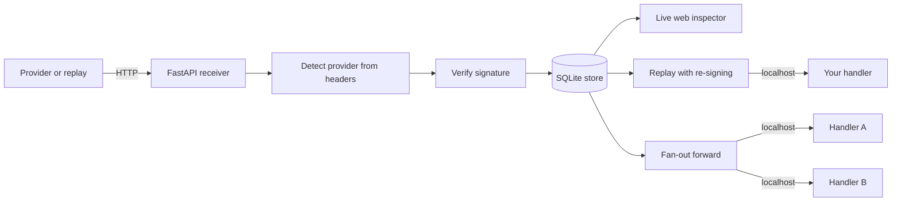

# webhook-toolkit

**Receive, verify, inspect and replay webhooks locally — no tunnel required.**


A local webhook development bench. Point a provider (or a captured payload) at a
FastAPI receiver that stores every request byte-for-byte, verifies the provider
signature, and shows it in a live web inspector. Then **replay** any stored event
to the handler you are building — re-signed with a fresh timestamp so it passes
verification — or **fan-out** live deliveries to several local services at once.

## Why

Webhooks are miserable to develop against. The provider lives on the public
internet; your handler lives on `localhost`. The usual answers are all annoying:

- **Tunnels** (ngrok, smee) expose your laptop, add latency, and the URL changes.
- **Real events** are slow to trigger and impossible to reproduce on demand.
- **Signature verification** is the one part you must not skip — and the one part
  that silently breaks the moment you re-serialize the body or replay a stale
  payload past its timestamp tolerance.

This toolkit removes the tunnel from the inner loop. Capture a delivery once (or
craft a fixture), then iterate on your handler by replaying it locally as many
times as you like, with correct signatures, in milliseconds.

## How it works



The receiver is a catch-all: `GET`, `POST`, `PUT`, `PATCH`, `DELETE`, `HEAD` and
`OPTIONS` on any path are captured, so you never have to configure routes to
start seeing traffic. The only paths it keeps for itself are the inspector's
(`GET /`, `GET /favicon.ico` and the `/api/events` JSON feed); FastAPI's
`/docs`, `/redoc` and `/openapi.json` are switched off so they are captured too. Bodies are stored as raw
bytes because signatures are computed over the exact byte stream — re-encoding
through a string would break verification on replay.

## Provider signatures

Each provider signs differently. The toolkit knows the exact header and scheme
for the common ones, plus a generic HMAC helper for everything else.

| Provider | Header | Scheme |
|----------|--------|--------|
| **GitHub** | `X-Hub-Signature-256` | `sha256=` + hex HMAC-SHA256 of the raw body |
| **Stripe** | `Stripe-Signature` | `t=<ts>,v1=<hex>` HMAC-SHA256 over `<ts>.<body>`, timestamp tolerance |
| **Slack** | `X-Slack-Signature` | `v0=` + hex HMAC-SHA256 over `v0:<ts>:<body>`, timestamp in `X-Slack-Request-Timestamp` |
| **Shopify** | `X-Shopify-Hmac-Sha256` | base64 HMAC-SHA256 of the raw body |
| **Generic** | *(you choose)* | HMAC of the raw body with configurable header, digest, hex or base64 encoding and prefix |

The generic provider is configured with `GENERIC_WEBHOOK_HEADER`,
`GENERIC_WEBHOOK_ALGORITHM` (`sha256` default, also `sha1`, `sha512`, ...),
`GENERIC_WEBHOOK_ENCODING` (`hex`/`base64`), `GENERIC_WEBHOOK_PREFIX` and
`GENERIC_WEBHOOK_SECRET`. Once the header is set, the receiver detects and
verifies it like the built-in providers, `replay --sign` re-signs it, and
`verify --provider generic` accepts the same settings as options.

> ### Always verify signatures
> An unverified webhook endpoint is an **unauthenticated POST from the internet**.
> Anyone who learns the URL can forge events. Verify the signature over the raw
> body **before** you parse or act on the payload, and reject on mismatch. Every
> example handler in this repo does exactly that (`verify_github` / `verify_stripe`
> return `401` / `400` on failure). Stripe and Slack additionally bind a timestamp
> into the signature to blunt replay attacks — which is why replaying an old
> capture requires re-signing with a fresh one.

## Quickstart

```bash
git clone https://github.com/AleBrito124356/webhook-toolkit.git
cd webhook-toolkit
python -m venv .venv && source .venv/bin/activate   # Windows: .venv\Scripts\activate
pip install -r requirements.txt

cp .env.example .env        # then fill in the signing secrets you have
```

Every command reads `./.env` on startup (or the file given with
`--env-file FILE`); variables already exported in your shell win over the file.
The example handlers read the same `.env`, so both sides share one secret.

Every secret in `.env.example` is an obvious placeholder — a literal `X` run or
a plainly-fake string — that no provider will accept. The toolkit treats them
explicitly:

- the **receiver** never labels a capture `invalid` because of a placeholder (a
  real provider cannot sign with one); it shows `no secret` instead, and only
  shows `verified` when the capture really was signed with that placeholder;
- **explicit commands** (`verify`, `replay --sign`) still use a placeholder, with
  a visible warning, so the local walkthrough against the bundled example
  handlers (which fall back to the same placeholders) works before you have
  real secrets.

## The no-tunnel workflow

**1. Start the receiver + inspector.**

```bash
python cli.py serve --port 8000
```

```
──────────────────────── webhook-toolkit ────────────────────────
Inspector : http://127.0.0.1:8000/
Receiver  : any method on http://127.0.0.1:8000/<any-path>
Database  : webhooks.db
──────────────────────────────────────────────────────────────────
```

Open `http://127.0.0.1:8000/` for the live inspector. Every capture appears with
a `verified` / `invalid` / `no secret` badge and an expandable body + headers.

**2. Get one real delivery** (or skip straight to the bundled fixture). Trigger
the event once from the provider dashboard, or — if you already have a tunnel for
a single capture — send it here. Each capture prints to the console:

```
#1 POST /webhooks/github | github | verified | 512 B | 2026-07-19T15:04:11Z
```

**3. Replay it at your handler as many times as you want**, re-signing so it
verifies against your handler's secret:

```bash
python cli.py replay 1 --to http://127.0.0.1:3001/webhooks/github --sign
```

```
OK replay #1 -> http://127.0.0.1:3001/webhooks/github (re-signed) | status 200 | 7 ms
```

No provider round-trip, no tunnel, fully reproducible.

## Usage

### Serve and forward

```bash
# Receive only
python cli.py serve --port 8000

# Receive AND fan-out every capture to two local handlers (mini smee)
python cli.py forward --port 8000 \
    --to http://127.0.0.1:3001/webhooks/github \
    --to http://127.0.0.1:3002/webhooks/stripe
```

Each forward reports a per-target status with retries on 5xx / connection errors:

```
forward #7 -> target                          status        attempts
http://127.0.0.1:3001/webhooks/github         200 ok               1
http://127.0.0.1:3002/webhooks/stripe         Connection refused   3
```

### Replay and modify-then-replay

```bash
# Replay stored event 2 to a Stripe handler, re-signing with the env secret
python cli.py replay 2 --to http://127.0.0.1:3002/webhooks/stripe --sign

# Debug a handler with an edited payload — re-signing keeps the signature valid
python cli.py replay 2 --to http://127.0.0.1:3002/webhooks/stripe \
    --sign --body edited_payload.json --header "X-Debug: 1"
```

### Verify a payload + signature pair — and find out *why* it fails

```bash
python cli.py verify --provider github \
    --payload payload.json \
    --signature "sha256=3e5403108ea4212413f575f986530161303770c55684656aeb4c4f1a8cef8a9c" \
    --secret my-dev-secret
```

```
INVALID GitHub signature (signature matches the payload with the trailing newline removed)
  code: mismatch
  hint: Something changed the bytes after they were signed (an editor saving the file, `echo`, a shell heredoc). Verify the exact bytes that were received.
```

A failure is never just "invalid". The diagnosis engine (`verify.diagnose`)
classifies it as `missing_signature_header`, `malformed_header`,
`missing_timestamp`, `timestamp_out_of_tolerance` (with the skew in seconds and
its direction) or `mismatch`, and for mismatches it re-computes the HMAC under
the mistakes people actually make until one explains the failure:

| Mistake it recognises | Example explanation |
|---|---|
| Trailing newline / CRLF added or removed, LF↔CRLF conversion (git `autocrlf`) | `signature matches the payload with CRLF line endings converted to LF` |
| JSON parsed and re-serialized (compact, `json.dumps` defaults, pretty, sorted keys, escaped non-ASCII) | `signature matches the payload re-serialized as compact JSON (no spaces)` |
| Whitespace or a newline around the secret | `signature matches the secret with surrounding whitespace removed` |
| Stripe `whsec_` prefix missing, dropped by the sender, or duplicated | `signature matches the secret with a 'whsec_' prefix added` |
| Svix / Standard Webhooks secrets (base64 after `whsec_`), hex-decoded secrets | `signature matches the base64-decoded secret (Svix / Standard Webhooks scheme)` |
| Secrets swapped between configured providers | `signature matches the secret configured for Shopify (SHOPIFY_WEBHOOK_SECRET)` |
| Hex vs base64, missing `sha256=` / `v0=` prefix, SHA-1 instead of SHA-256, uppercase hex | `the digest is hex-encoded but Shopify sends base64` + "the digest itself is correct" |
| Only GitHub's legacy `X-Hub-Signature` (SHA-1) present | "it matches your secret … whatever delivered this dropped X-Hub-Signature-256" |
| Stripe/Slack signature computed without the timestamp | `signature is an HMAC of the body alone, without the timestamp` |
| Stale or future timestamps, millisecond timestamps | `timestamp is 3601 s old, tolerance 300 s` + "the signature itself is valid … replay it with --sign" |

Exit codes: `0` valid, `1` invalid, `2` usage error (missing secret, bad
options). `--json` prints the diagnosis as JSON, `--header 'Name: value'` adds
extra request headers (e.g. the legacy `X-Hub-Signature`), `--tolerance 0`
disables the Stripe/Slack timestamp check and `--now <epoch>` pins the clock.
`python cli.py show <id>` prints a stored capture with the same diagnosis; the
receiver stores the one-line reason with every capture and `list` shows it.

### Inspect, export, import

```bash
python cli.py list --limit 20                       # recent captures as a table
python cli.py import examples/fixtures/github_push.json
python cli.py export my_fixtures.json               # share a reproduction
```

Fixtures are plain JSON with base64-encoded bodies, so binary payloads round-trip
exactly and you can commit them as deterministic test inputs.

### Use the verifiers in your own handler

```python
from fastapi import FastAPI, Header, HTTPException, Request
from src.webhooks.verify import verify_github

app = FastAPI()

@app.post("/webhooks/github")
async def github(request: Request, x_hub_signature_256: str | None = Header(None)):
    raw = await request.body()                     # raw bytes, never a parsed model
    if not verify_github(SECRET, raw, x_hub_signature_256):
        raise HTTPException(401, "invalid signature")
    ...  # safe to parse and act now
```

Full runnable versions live in `examples/handlers/`.

## Project structure

```
webhook-toolkit/
├── cli.py                       # serve, forward, replay, verify, list, export, import
├── src/webhooks/
│   ├── server.py                # FastAPI catch-all receiver + live console
│   ├── inspector.py             # self-contained inline HTML inspector (no CDN)
│   ├── verify.py                # sign_/verify_ pairs + provider registry
│   ├── storage.py               # SQLite store, raw-byte bodies
│   ├── replay.py                # build/send replays, re-signing
│   ├── forward.py               # fan-out with retries and per-target status
│   ├── fixtures.py              # JSON export / import
│   └── config.py                # env-based secrets, placeholder detection
├── examples/
│   ├── handlers/                # verified GitHub push + Stripe payment handlers
│   └── fixtures/github_push.json
├── tests/                       # 36 tests: verify vectors, replay re-sign, storage
├── .env.example
└── requirements.txt
```

## Design notes

- **Symmetric sign/verify.** Every provider has a `sign_*` that produces exactly
  the header a provider would send and a `verify_*` that checks one in constant
  time (`hmac.compare_digest`). Re-signing on replay and computing test vectors
  both fall out of the signing half — so no real-looking token is ever hardcoded.
- **Pure builders, isolated I/O.** `build_replay_request` is a pure function that
  turns a stored event into the outgoing request; the network call is one thin
  wrapper around it. That is why re-signing is unit-tested without a socket.
- **Raw bytes end to end.** Bodies are `BLOB`s and never decoded before hashing,
  so a replayed payload is byte-identical to the original.

## Testing

```bash
pip install -r requirements-dev.txt
pytest
```

The suite computes every expected signature **inside the test** from a fake,
runtime-assembled secret, then checks that tampering the body, the secret, or the
timestamp is rejected — no credential-shaped strings live on disk.

## Related projects

- **[fastapi-production-template](https://github.com/AleBrito124356/fastapi-production-template)** — FastAPI starter with async SQLAlchemy, JWT, Redis and CI; the natural home for the handlers you build here.
- **[api-mock-server](https://github.com/AleBrito124356/api-mock-server)** — config-driven mock REST API with latency and error injection; pairs with this for full local integration testing.
- **[git-hooks-collection](https://github.com/AleBrito124356/git-hooks-collection)** — a real secret scanner and pre-commit guards, so the placeholder discipline in this repo is enforced in yours.
- **[observability-starter](https://github.com/AleBrito124356/observability-starter)** — OpenTelemetry tracing, Prometheus metrics and structured logs on FastAPI, for when your webhook handlers go to production.

## License

MIT © 2026 Alejandro Brito. See [LICENSE](LICENSE).
